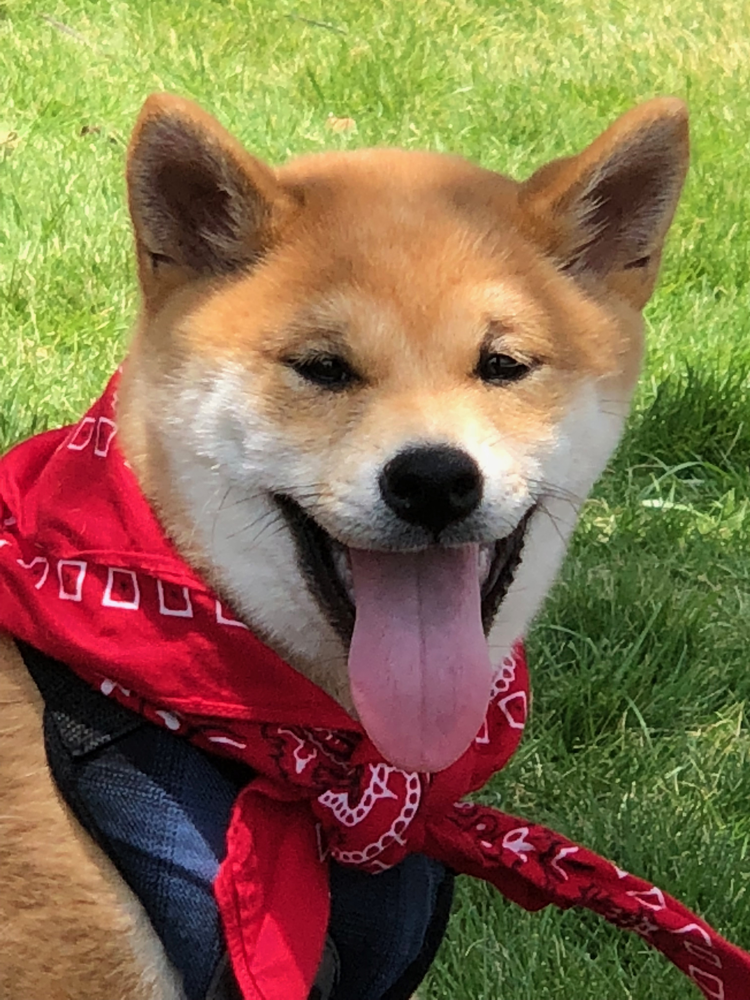
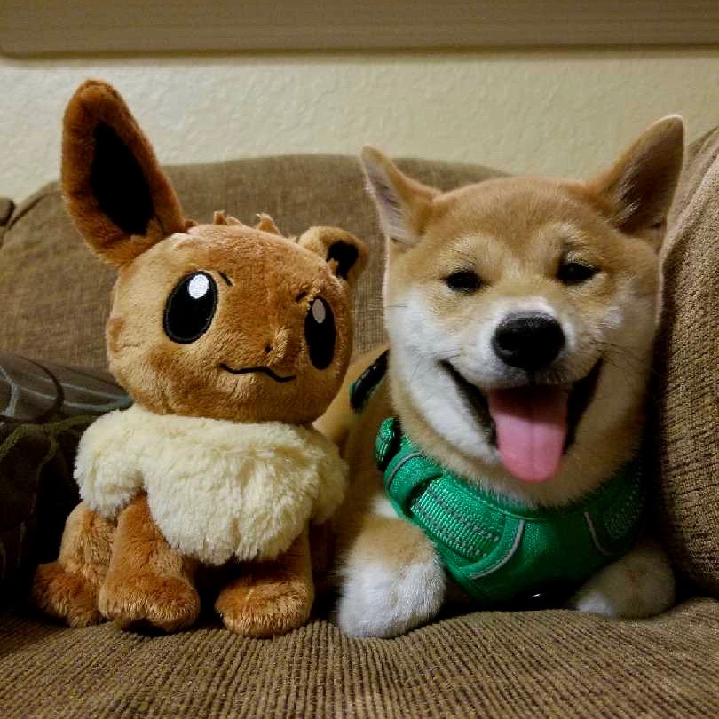
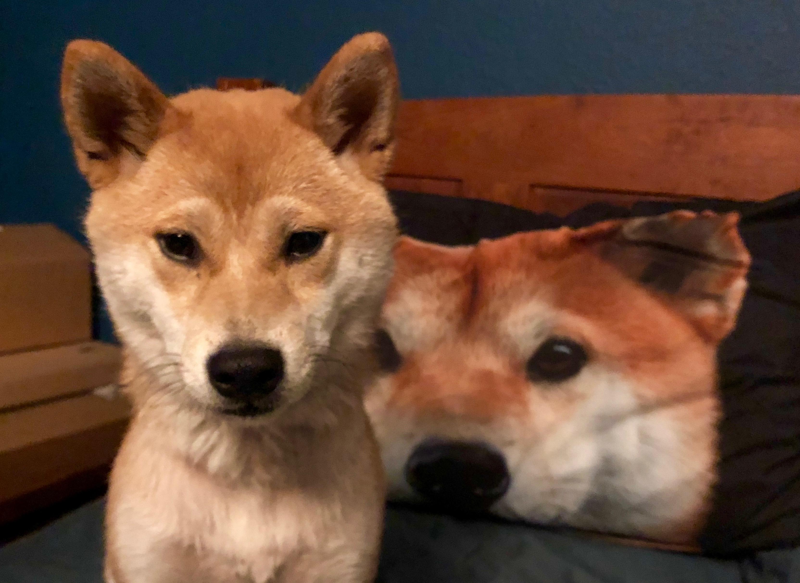
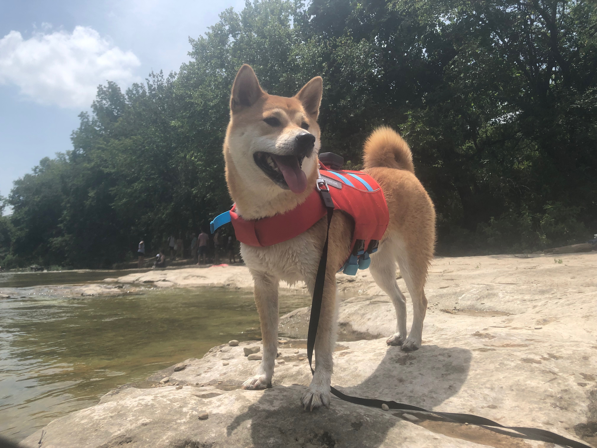
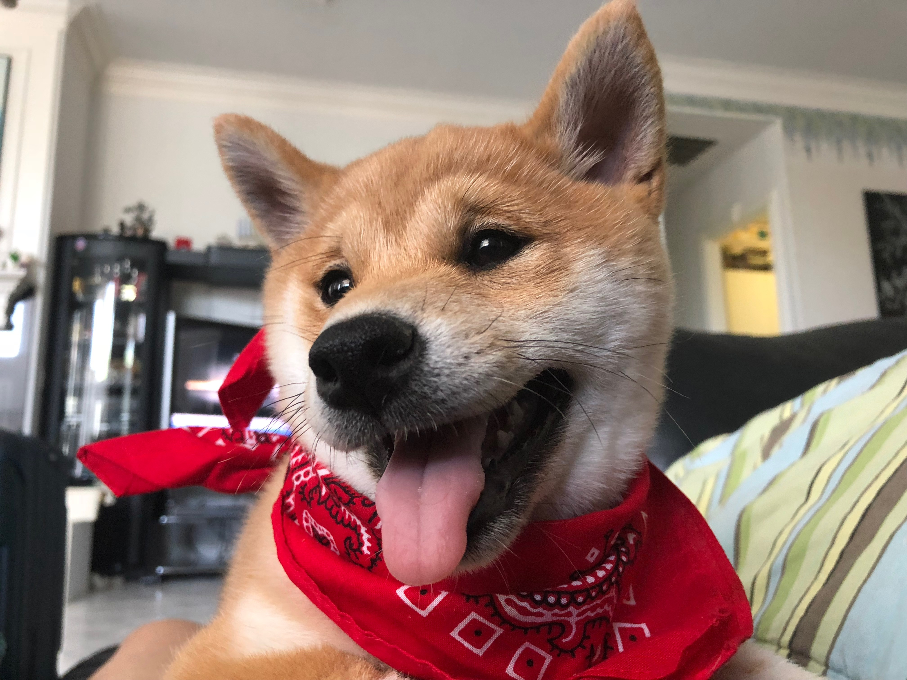

<!DOCTYPE html>
<html>
<head>
    <link href="css/reset.css" rel="stylesheet" type="text/css">
  <link href="css/eevee.css" rel="stylesheet" type="text/css">
 
</head>

<body>
    <nav class="navbar">
        
Home

        
Diet

        
Habitat

    </nav>
        
 
            

                
                
Eevee "Stevie" Bear

            

            
 
                

                    Pet Stats:
                

                

                    Breed: Shiba Inu
                     
                     
                    Age: 1 year old
                     
                     
                    Favorite Toy: Mark Hlaing
                     
                     
                    Average Walk Per Day: 2 Miles
                     
                     
                    Owner Name: Mark Hlaing
                

            

        

        

            

                

                

                   
                    The Eeveeiest bear of the all! 
                

                

            

            

    
Pictures of My Love

    
 
        
        
    

            

            
        

</body>
</html>
